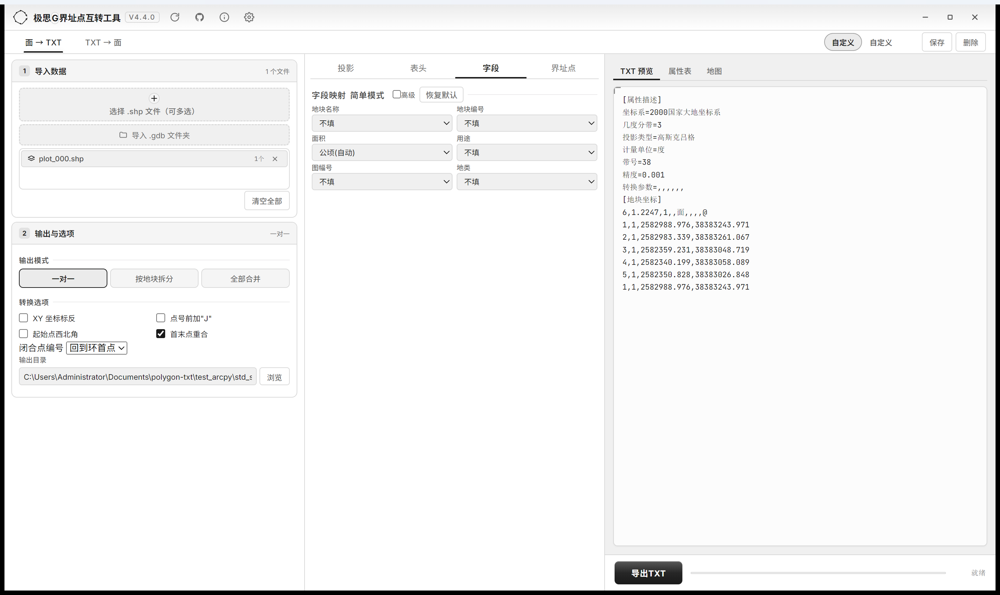
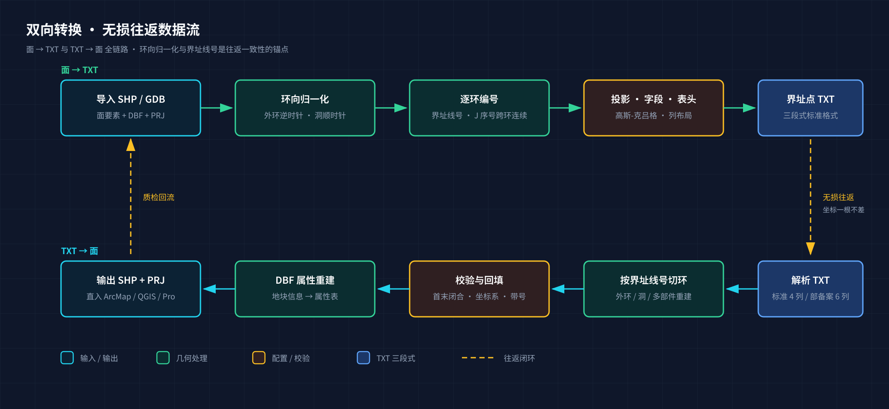
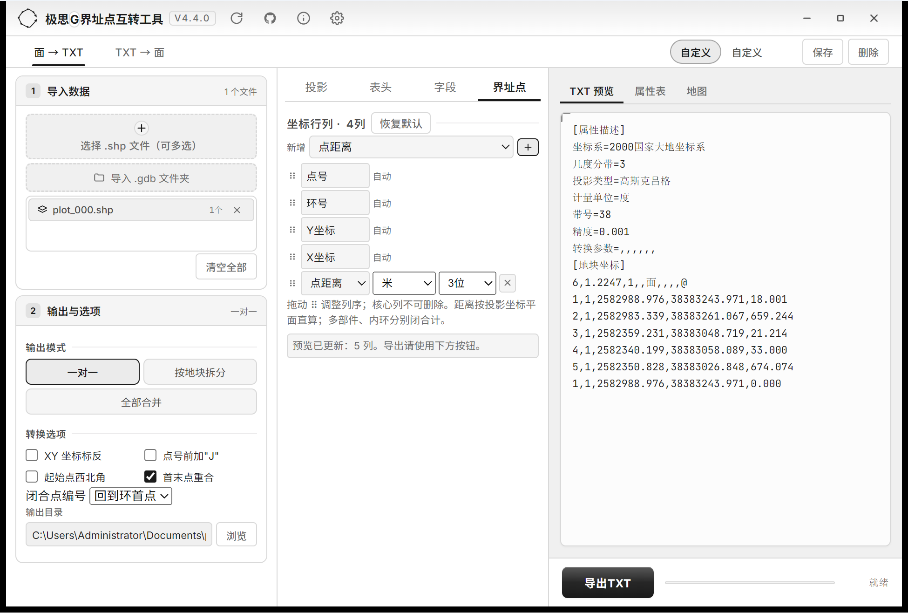
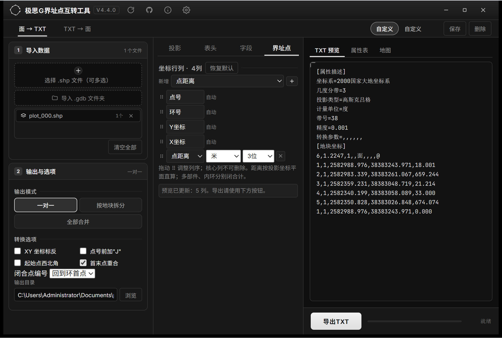
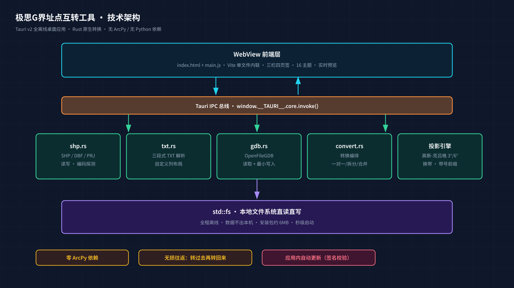

<div align="center">
  
  <h1>极思G界址点互转工具 <sub>(Boundary Point Converter)</sub></h1>
  <p>Two-way conversion between polygon features (SHP / GDB) and standard boundary-point TXT files — a lightweight GIS desktop tool built for surveying & land-administration workflows</p>
  <p>
    <a href="https://github.com/edcfoshan/polygon-txt/releases"></a>
    
    
    <a href="./LICENSE"></a>
  </p>
</div>

English | [中文](./README.md)



## Overview

**Boundary Point Converter** converts between polygon features (SHP / GDB) and the standard Chinese boundary-point TXT format. Traditionally this round-trip means ArcMap plus Python scripts or tedious manual editing. This tool turns that most-repeated small job into a **one-click operation** — pick files, click convert, done; no code in between. Pure Rust, **no ArcPy / ArcGIS required**, fully offline — your data never leaves the machine.

## Key Features

- **Polygons → TXT**: import SHP / GDB polygon layers, export standard boundary-point TXT
- **TXT → polygons**: parse TXT (standard 4-column or 6-column filing format) into SHP with attribute table
- Three output modes: one-file-per-source / split per plot / merge all
- **Custom boundary-point columns**: core columns (point no. / ring no. / Y / X) plus fixed-value, source-field and point-distance columns in any order; distance unit & decimals configurable per column
- Supports **CGCS2000, Xi'an 1980, Beijing 1954, WGS84**
- Gauss-Krüger 3°/6° zone projection, PRJ auto-detection with zone extraction; projected metric output with zone prefix
- Field mapping presets (simple / advanced / cultivated-land 12-field template), automatic area calculation (m² / ha)
- **Reset-to-defaults** button on every middle-panel tab (projection / header / fields / boundary points)
- Light / dark × 8 color schemes = 16 accessible themes (WCAG contrast); window size & position remembered
- **In-app auto-update** with signature verification (green arrow in the title bar)

## Feature Highlights

### 1. Lossless round-trip conversion

**Polygons → TXT** normalizes ring orientation (outer CCW, holes CW), numbers each ring's boundary-line index, and reads CRS & zone from PRJ. **TXT → polygons** re-splits rings by boundary-line index, validates ring closure and rebuilds the DBF attribute table. Round-trip is lossless — coordinates come back byte-identical.



- **Three output modes**: per source / per plot (file name from DKMC etc.) / merged archive with timestamp
- SHP read failures are surfaced in the UI with file name and reason

### 2. Custom boundary-point column layout

The v4 flagship: every column of the coordinate line is configurable — keep the core columns (point no. / ring no. / Y / X) and add **fixed-value columns**, **source-field columns** (DBF attributes appended to the coordinate line) or **point-distance columns** (planar distance, unit m/km/cm and 0–6 decimals per column). Drag to reorder; preview and all three output modes share one layout. Closing points get distance 0; open rings get the closing edge length; multi-parts and holes are computed separately.



### 3. Field mapping, simple to professional

- **Simple mode**: six slots (name / code / area / usage / map sheet / land type) picked straight from source fields
- **Advanced mode**: 14-item field list, freely added, removed and reordered; save as reusable presets
- **Cultivated-land preset**: one click loads the 12-field reporting template

Field names support CN/EN placeholders (DKMC / DKBH industry conventions); areas auto-computed in m² or ha; unmapped fields emit empty columns to keep column order stable.

### 4. Dynamic projection

Four CRS families with PRJ auto-detection. **Dynamic projection** performs 3°/6° zone conversion, zone shifting (e.g. 38 → 39) and geodetic conversion at export time, recommending target form and central meridian automatically. The **zone-prefix** toggle is orthogonal to projection and smart-defaults on import.

### 5. Interface & themes

Three-column workspace: **left** import + output options, **middle** four tabs (projection / header / fields / boundary points), **right** live preview (TXT / attribute table / map). Every tab has a **reset-to-defaults** button. Light / dark × 8 color schemes (16 combinations), all meeting WCAG contrast; settings and window geometry persist across launches.



## Three Typical Workflows

**Land registration — batch boundary-point tables.** Hundreds of parcels must be delivered on deadline. Import SHP, choose "split per plot", name files by parcel code — one click, one TXT per parcel, areas computed in hectares automatically.

**Cultivated-land reporting.** Load the 12-field preset in advanced mode, map to source GDB columns, export in the receiver's agreed column order.

**Field TXT QC.** Import field-team TXTs back into polygons: ring splitting and closure validation expose missing points, swapped coordinate order and wrong zone numbers immediately; compare the round-trip result with confidence.

## Architecture

Built on **Tauri v2** (Rust backend + WebView frontend). The UI layer handles interaction and live preview only; all conversion happens in native Rust modules (txt / shp·dbf·prj / OpenFileGDB / orchestration / Gauss-Krüger projection) over the IPC bus, reading and writing local files directly.



Compiled native Rust — tens of thousands of parcels per minute; no ArcPy / ArcGIS needed, portable build runs unpacked; ~6 MB installer, instant start, fully offline.

## Download

Grab the latest build from [Releases](https://github.com/edcfoshan/polygon-txt/releases).

| Platform | Requirement | File |
|----------|-------------|------|
| **Windows** | Windows 10/11 64-bit | `polygon-txt_X.X_x64-setup.exe` (recommended) or `-portable.exe` |
| **macOS** | macOS 10.15+ | `.dmg` (arm64 = Apple Silicon, x64 = Intel) |
| **Linux** | Ubuntu 20.04+ / mainstream distros | `.AppImage` or `.deb` |

> Release assets display Chinese names, while actual download URLs are ASCII file names (GitHub limitation) — match by the table above.

> ⚠️ Windows 7 is not supported (WebView2 requires Win10+). If SmartScreen intervenes on first run, choose "More info → Run anyway".

**Auto-update**: installed users just click the green arrow in the title bar — signature-verified in-app update, no manual download.

### Build from source

Prerequisites: [Node.js](https://nodejs.org/) and [Rust](https://www.rust-lang.org/)

```bash
npm install         # frontend deps
npm run tauri dev   # development with hot reload
npm run tauri build # production build
```

Pushing a `v*` tag triggers the four-platform CI build, updater signing and automatic release — see [CI-CD docs](./docs/CI-CD.md).

## TXT Format Example

Output uses the standard three-section format (advanced field mode, minimal example):

```text
[J1,1,39521000.123,3758100.456]
[J2,1,39521000.234,3758100.567]
[J3,1,39521000.345,3758100.678]
[J4,1,39521000.456,3758100.789]
[J1,1,39521000.123,3758100.456],@
```

- Coordinate line: `J{seq},{ring index},Y,X` — **Y (northing) first**; J sequence increments continuously across rings within one parcel
- The second column is the boundary-line index (outer ring = 1, holes & parts follow) — the sole key for TXT → SHP ring splitting
- Metadata lines end with `,@`; CRS strings must match exactly (`2000国家大地坐标系` etc.)
- Column layout is customizable beyond these four columns (see feature 2)

## Tech Stack

- **Tauri v2** (Rust backend + WebView frontend)
- **Rust**: `shapefile` / `geonative-filegdb` / `chrono` / `dbase` / `encoding_rs` / `geo-types`
- **Frontend**: vanilla JS + Vite (single-file bundle inlined into `dist/index.html`)

## Known Limitations

- **GDB writing**: minimal OpenFileGDB writer; ArcGIS Pro compatibility is limited (fallback: `ogr2ogr -f "OpenFileGDB"`)
- **Government SHP variants**: some files in `test_data/` use a non-standard format (magic ≠ 9994)
- **Bundling**: `bundle.targets` is `nsis` only; if NSIS fails, the bare exe under `src-tauri/target/release/` still runs
- **Google Fonts**: loaded online; falls back to system fonts offline

## License

[MIT License](./LICENSE)

## Community

Issues and feature requests via [Issues](https://github.com/edcfoshan/polygon-txt/issues); usage discussion in [Discussions](https://github.com/edcfoshan/polygon-txt/discussions).

---

Powered by **极思 G**
