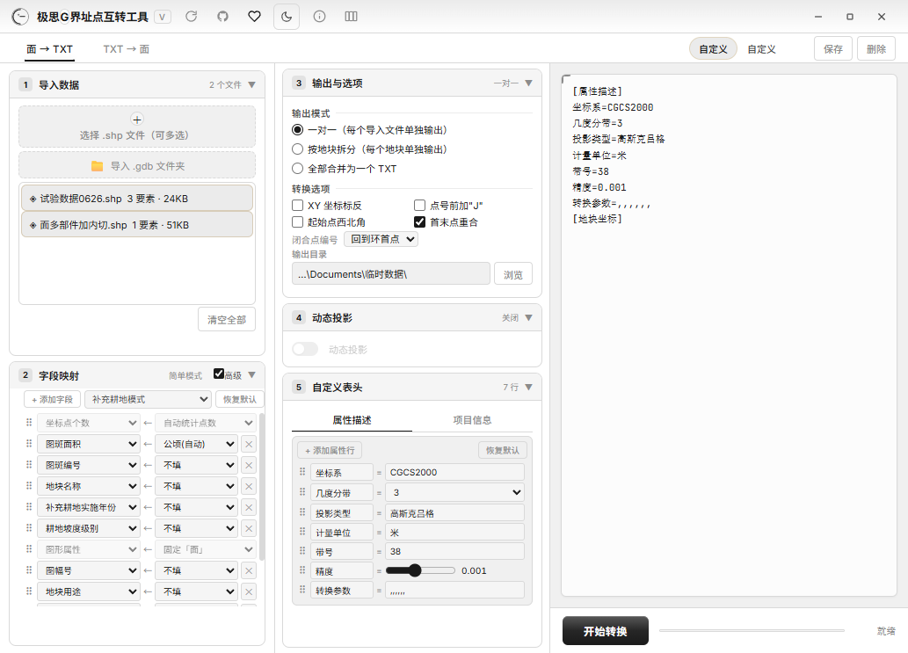

# polygon-txt

> Boundary-Point Converter — bidirectional conversion between polygon features (SHP / GDB) and standard boundary-point TXT files. A lightweight GIS desktop tool for the surveying & land-management industries.

English | [中文](./README.md)


## Overview

A lightweight GIS desktop tool for the surveying & land-management industries. Converts polygon features (SHP / GDB) to and from standard boundary-point TXT files.

In traditional workflows, converting between boundary-point TXT and GIS polygon features usually requires ArcMap + Python scripts or manual processing — tedious and error-prone. This tool turns the most common micro-task into a one-click operation: pick files, click convert, get results. No code required. Pure Rust — **no ArcPy / ArcGIS needed**.

## Features

- **Polygon → TXT**: import SHP / GDB polygons, export standard boundary-point TXT
- **TXT → Polygon**: parse TXT files, generate SHP vector polygons with attribute data
- Three output modes: one-to-one / split-by-plot / merge-all
- Supports **CGCS2000, Xi'an 1980, Beijing 1954, WGS84**
- Gauss-Krüger 3° / 6° zones, automatic PRJ recognition and zone extraction
- **Kilometric grid output**: when input is geographic coordinates (degrees), one-click projection to CGCS2000 Gauss-Krüger plane coordinates (meters) with zone prefix; auto-disabled for already-projected data
- Three-tier field mapping (Simple / Advanced / Supplementary Cultivation presets)
- Automatic area calculation (m² or hectares)
- 16 theme combinations (light / dark × 8 color schemes); collapsible three-column layout; window size & position fully remembered

## Core Features in Detail

### 1. Bidirectional Conversion · Lossless Round-Trip

Conversion is more than copy-paste. The **polygon → TXT** path normalizes ring orientation (outer counter-clockwise, holes clockwise), detects holes & multi-parts, and assigns per-ring line numbers; it also reads PRJ to auto-identify the CRS and extract the zone number. The **TXT → polygon** path reconstructs polygons by line number, validates first/last point closure, and back-fills the DBF attribute table. The whole pipeline is **lossless round-trip** — convert out and back, every coordinate is identical.


- **Polygon → TXT**: SHP / GDB polygons one-click to standard boundary-point TXT; J sequence numbers increment continuously across rings within a single plot
- **TXT → Polygon**: parse TXT, output SHP with attribute tables, ready for ArcMap / QGIS / ArcGIS Pro
- **Three output modes**: one-to-one (one TXT per source) / split-by-plot (filename from DKMC etc.) / merge-all (whole archive with timestamp)

### 2. Field Mapping · From Simple to Professional

Three-tier field mapping covers different precision needs:

- **Simple mode**: six slots — plot name, ID, area, use, sheet number, land type — pick from source-field dropdowns
- **Advanced mode**: 14 fixed fields, add/remove and drag-reorder freely
- **Supplementary Cultivation preset**: one-click load the 12-field template (polygon area, polygon ID, implementation year, slope grade, remarks, quality grade, etc.), drop-in ready for government reporting



Field names support Chinese / English placeholders (DKMC / DKBH industry conventions), area auto-calculated in m² or hectares, unselected fields output empty value columns to keep column order stable.

### 3. Dynamic Projection · Full CRS Coverage

Supports the four major CRS — CGCS2000, Xi'an 1980, Beijing 1954, WGS84 — with automatic PRJ recognition. The **dynamic projection** feature lets you one-click swap 3° / 6° zones, re-band (e.g. zone 38 → 39), or convert to geographic coordinates during export. The dialog auto-recommends the target format and central meridian based on the imported data's lat/lon range — no manual lookup tables.

### 4. Interface Memory · Pick Up Where You Left Off

All settings (presets, field mappings, custom headers, theme, color scheme, display ratio) plus **window size and position** are persisted. Close and reopen — everything stays exactly as you left it, no reconfiguration.

## Three Typical Scenarios

**Scenario 1: Real-Estate Registration · Batch Boundary-Point Tables**

Hundreds of cadastral polygons in the database, deadline to deliver all boundary-point materials. Import SHP, choose "split-by-plot", filename from plot ID — one click and every parcel has its own TXT, filename = ID, clean delivery list. Area auto-calculated in hectares and written into the attribute block; no need to fire up Excel.

**Scenario 2: Supplementary Cultivation · Reporting Compliance**

Supplementary cultivation projects require a 12-field format: polygon area, polygon ID, implementation year, slope grade, land type, quality grade, etc. Manually assembling the format easily misaligns columns. Pick the "Supplementary Cultivation" preset in advanced field mode — 12 fields lined up in one shot, mapped to source GDB attribute columns for batch export, drop-in compatible with the receiver's expected column order.

**Scenario 3: Field-Collected TXT · Round-Trip QA**

A batch of boundary-point TXT files come back from the field; you need to rebuild polygons and run QA. The TXT → polygon path reconstructs by line number and validates first/last point closure — old problems like **missing coordinate points, reversed coordinate order, wrong zone number** surface immediately during reverse conversion; comparing the output against the original verifies a lossless round-trip.

## V3.0 UI Refresh

V3.0 is the biggest UI overhaul to date — redesigned with a **"collapsible organizer"** layout. Features unchanged, habits unchanged.

### Numbered Sections, All-in-One View

Three-column layout: left column **① Import + ② Field Mapping**, middle column **③ Output & Options (incl. output dir) + ④ Dynamic Projection + ⑤ Custom Header**, right column live preview. Each section is a numbered collapsible card — click the title to expand/collapse. Configurations never crowd the screen; common items are open by default.

The TXT → polygon direction follows the same **① Import TXT + ② Output Settings** numbered-section pattern, consistent across both directions.

### 16 Theme Combinations

The title-bar theme button is upgraded to a dropdown panel: **light / dark** × **8 color schemes** (Classic B&W (new default) / Surveying Brass / Forest Green / Sea Blue / Cyan Blue / Crimson Purple / Coral Orange / Rose). The color scheme drives the entire palette — background, panel, border, preview area — all together. Want the industry look? Pick Surveying Brass. Strong outdoor light? Switch to dark. Choices are auto-remembered.


### Other Improvements

- "Supplementary Cultivation" upgraded to a preset dropdown (8-field standard / Supplementary Cultivation / Custom); manual edits auto-switch to "Custom"
- Preview area uses black font in light mode for easier reading of long coordinate lines; fixed button-text contrast in the B&W theme
- Default window 1100×800, three columns 1:1:1.3, wider preview; custom headers display in full


## Architecture

Built on **Tauri v2** (Rust backend + WebView frontend): the UI layer handles interaction and live preview only; all conversion logic runs in native Rust modules (TXT parsing & generation / SHP·DBF·PRJ I/O / OpenFileGDB / conversion orchestration / Gauss-Krüger projection), communicating over IPC. Local files read and written directly.


Pure-Rust compiled native code — no interpreter overhead — handles tens of thousands of plots in minutes. No ArcPy / ArcGIS required, portable edition works straight out of the box; installer ~5MB, sub-second startup, fully offline, data never leaves your machine.

## Download

Grab the latest Windows installer from [Releases](https://github.com/edcfoshan/polygon-txt/releases) (NSIS installer + portable edition). Double-click to install.

**Baidu Pan (alternative)**: <https://pan.baidu.com/s/1xyW3-hyZrFDDG9ijYOf46g> code `e8vy`

**Users with an older version already installed: no manual download needed — open the app, click the refresh button on the top-right of the title bar, and one-click auto-update to the latest version.**

Installer ~5MB, portable edition runs straight out of the box, sub-second startup, fully offline, data never leaves your machine.

## TXT Format Example

The boundary-point TXT output uses a three-section structure. Minimum example (advanced field mode, no header row):

```text
[J1,1,39521000.123,3758100.456]
[J2,1,39521000.234,3758100.567]
[J3,1,39521000.345,3758100.678]
[J4,1,39521000.456,3758100.789]
[J1,1,39521000.123,3758100.456],@
[Plot Metadata]
Plot Name=Demo Parcel
Plot ID=BC0001
Land Use=Residential
Owner=John Doe
Parcel Area=1234.56
Sheet Number=50.00-25.00
CRS=CGCS2000
Unit=m²
```

- Coordinate row `J{seq},{ring_id},Y,X` — **Y first** (northing / easting), J sequence numbers increment continuously across rings within a single plot, starting from J1
- The `ring_id` column = `IndexedRing.part_index` (outer ring = 1, hole = 2, next part = 3, …), the sole key for reverse-parsing TXT → SHP ring splitting
- The closing point (last point overlapping first) defaults to writing the ring's first-point sequence number without consuming a number (switch to "continuation" with the `oc` option)
- Metadata rows end with `,@`; CRS strings must exactly match `CGCS2000` / `Xi'an 1980` / `Beijing 1954` / `WGS84`

## Build from Source

Prerequisites: [Node.js](https://nodejs.org/), [Rust](https://www.rust-lang.org/)

```bash
npm install         # install frontend dependencies
npm run tauri dev   # development mode (HMR)
npm run tauri build # production build (outputs NSIS installer)
```

## Tech Stack

- **Tauri v2** (Rust backend + WebView frontend)
- **Rust**: `shapefile` / `geonative-filegdb` / `chrono` / `dbase` / `encoding_rs` / `geo-types`
- **Frontend**: vanilla JS + Vite (single-file bundle, all JS inlined into `dist/index.html`)

## Known Limitations

- **GDB writing**: minimal OpenFileGDB implementation; ArcGIS Pro compatibility is limited (fall back to `ogr2ogr -f "OpenFileGDB"`)
- **Government SHP formats**: some `.shp` files in `test_data/` use non-standard formats (magic ≠ 9994) and may fail to read
- **Packaging**: `bundle.targets` is `nsis` only (no MSI / WiX). If NSIS packaging fails, `src-tauri/target/release/jisig-bpoint-converter.exe` still runs directly
- **Google Fonts**: requires online access to load Inter / Noto Sans SC / JetBrains Mono; offline fallback to system fonts
- **G mode (6° → 3° re-band)**: `gauss_kruger_inverse` for 6°-zone sources is marked `#[ignore]` in tests, less reliable than other modes

## License

[MIT License](./LICENSE)

## Community & Support

Scan to join the discussion group:


If this tool saved you a few hours (or a few days), consider sponsoring to keep it going:


Bug reports and feature requests: [GitHub Issues](https://github.com/edcfoshan/polygon-txt/issues) · Usage discussion: [GitHub Discussions](https://github.com/edcfoshan/polygon-txt/discussions)

---

Powered by **极思 G (Jisi G)**