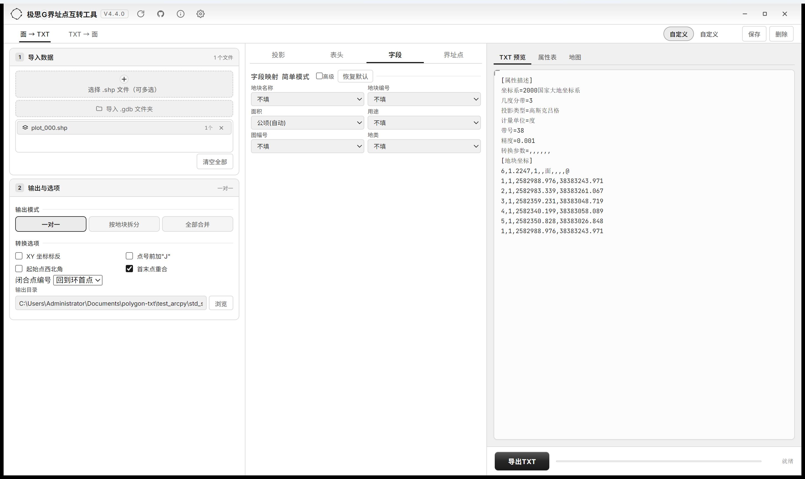
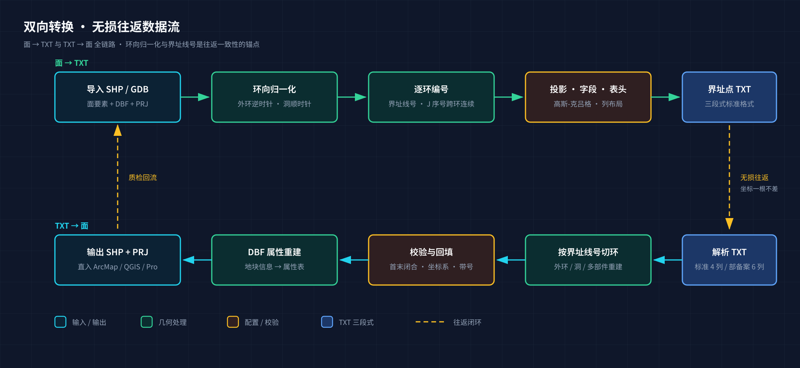
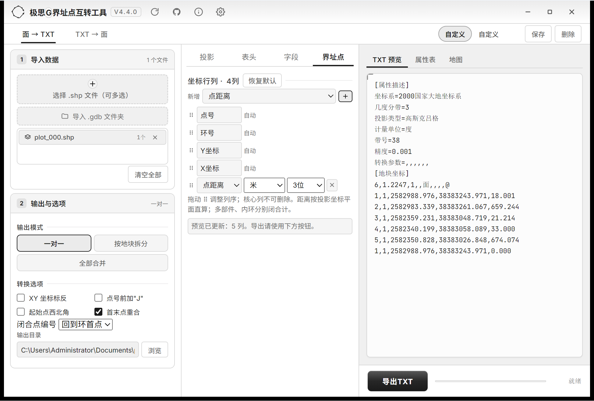
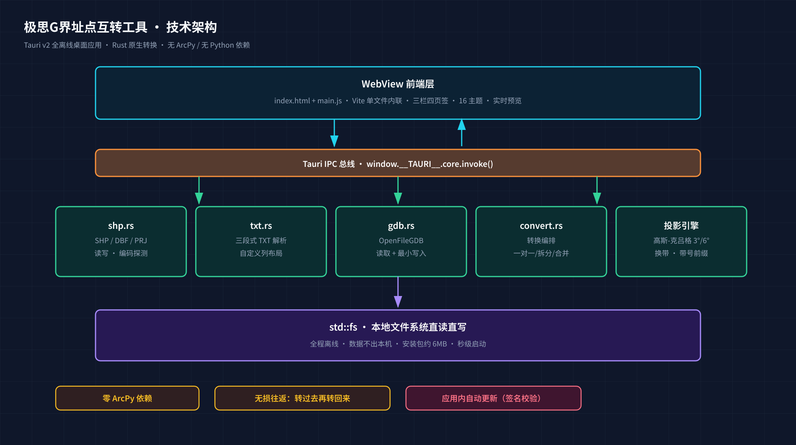

  
  <h1>Boundary Point Converter</h1>
  
Keep file formats out of the way and get boundary-point deliverables done faster.

  

    
    
    
    
  

English | [中文](./README.md)

## Overview

**Boundary Point Converter** does one job: convert GIS polygon data and boundary-point TXT files in both directions. Surveying, natural-resources, and land-registration work often needs polygons turned into TXT and returned TXT files turned back into polygons.

The time-consuming part is often the work around conversion: matching fields, checking coordinates, arranging columns, choosing an encoding, and finding missing plots. This desktop workspace brings those steps together: import data, configure the TXT structure, inspect the preview, and export the deliverables.

Input supports standard SHP and polygon features in OpenFileGDB. TXT can be converted to SHP. Files are read and written locally; ArcGIS and ArcPy are not required, and business data is not uploaded to a server. Basemaps and online fonts require an internet connection. File conversion remains available offline.

## Key Features

- **Polygons to TXT**: read SHP files or polygon feature classes in GDB and generate boundary-point coordinates and parcel attributes.
- **TXT to polygons**: read standard boundary-point TXT, rebuild polygon rings by boundary-line index, and export SHP with its companion files.
- **Three TXT output modes**: one file per source, one file per plot, or one merged file for multiple sources.
- **Project-specific output**: configure attribute fields, area units and precision, boundary-point column order, extra columns, coordinate-system headers, and TXT encoding.
- **Pre-export checks**: inspect TXT preview, attribute table, and map; filter plots by attributes and use the same selection for preview and export.
- **Coordinate and projection settings**: recognize common PRJ information and configure CGCS2000, Xi'an 1980, Beijing 1954, WGS84, and related Gauss-Krüger 3° / 6° zone handling.
- **Desktop builds for Windows, macOS, and Linux**: download an installer or portable build from GitHub Releases.

## Feature Guide

### 1. Convert polygons to TXT and back

When exporting polygons, the tool reads geometry, attribute fields, and coordinate reference information, then writes coordinate rows and parcel attributes. A plot may contain an exterior ring, interior rings, or multiple parts. The boundary-line index distinguishes rings, and TXT coordinate rows place Y before X.

When importing TXT, the tool reads the coordinate-system and parcel information, splits coordinate rings by boundary-line index, and creates SHP files with DBF, PRJ, and other companion files. Standard four-column coordinate rows are supported. The two extra columns in the six-column ministry filing format are ignored.

This workflow connects GIS parcel polygons with TXT files received from field teams or project partners. Check the coordinate reference declaration and project format requirements before processing, then inspect the output.

### 2. Choose how to organize the output

Polygon-to-TXT conversion supports three output modes:

- **One-to-one**: create one TXT per SHP file or GDB feature class. A numeric suffix is added to avoid overwriting files with duplicate names.
- **Split by plot**: create one TXT per plot in a subfolder for each input source. File names can use the plot name, plot number, sequence number, or FID. Missing or duplicate values fall back to sequence numbers.
- **Merge all**: combine plots from multiple input sources into one timestamped TXT. This option is available when more than one source is imported.

Need to deliver only part of a dataset? Filter plots in the attribute table first. The map, preview, and export all use the same selection.

### 3. Map fields to the receiving template

Field mapping has simple and advanced modes. Simple mode quickly maps commonly used attributes. Advanced mode lets you edit field rows and output content. Presets are available for common workflows such as cultivated-land reporting; adjust the mappings to match the current source fields.

Area values can be mapped directly from a source field or calculated from polygon geometry. Automatic area calculation supports square meters, mu, hectares, and square kilometers, with 0–6 decimal places per configuration. Simple and advanced modes keep separate settings, so switching modes does not overwrite edits in the other mode.

Field mapping controls the attributes written to TXT; it does not modify the input data. Before a batch export, check field matches, empty values, and area units in the preview.

### 4. Arrange coordinate columns and add data

In the Boundary Points settings, drag to reorder core columns such as point number, ring number, Y, and X. You can also add:

- **Fixed-value columns** that write the same configured value on each coordinate row.
- **Source-field columns** that copy a selected parcel attribute.
- **Point-distance columns** that calculate distance between boundary points. Each column has its own unit—meters, kilometers, or centimeters—and 0–6 decimal places.
- **Sequence columns** that number the coordinate rows starting at 1. Numbers can continue across plots or restart for each plot.

Distances are calculated separately for each ring. A closing point that repeats the first point has distance 0. For an open ring, the last point's distance is the closing edge back to the first point. Different rings and multipart polygons are never joined into one distance calculation.

TXT preview and export share the same layout settings. Arrange the columns and check the preview before exporting.

The diagram shows the available choices: the default seven header rows can be added, removed, renamed, and reordered; six common attribute slots support quick mapping, with additional fields available in advanced mode; and the point number, ring number, Y, and X columns can be reordered or supplemented with sequence, fixed-value, source-field, and point-distance columns. Project information is optional, and encoding and output mode are configurable.

### 5. Review coordinate information before export

The tool can read common coordinate-system and zone information from a SHP PRJ file or GDB layer spatial reference. It supports CGCS2000, Xi'an 1980, Beijing 1954, WGS84, and related Gauss-Krüger 3° / 6° zone settings. Review and configure these options in the Projection tab; adjust the TXT header to match project requirements.

Correct projection settings depend on the source data's coordinate reference declaration and project conventions. For cross-zone data, special projections, missing PRJ information, or uncertain sources, test a small sample first and verify its location, zone, and attributes in the target GIS software.

### 6. A three-column workspace

The interface uses three columns:

- **Left: input data and output options.** Input, output, and export settings change with the conversion direction.
- **Middle: projection, header, fields, and boundary points.** Configure each area in its own tab. The Fields tab is selected by default, and the input and output cards stay expanded.
- **Right: preview and checks.** For polygon-to-TXT conversion, switch between TXT preview, attribute table, and map.

Column widths scale with the window while retaining minimum widths for controls. The interface supports light and dark modes and multiple color schemes; settings are stored locally.

## Three Common Workflows

**Batch-export parcel boundary points.** Import parcel SHP files or GDB feature classes, check the coordinate reference and field mapping, and split the output by plot. Use parcel names or numbers for file names, filter to the plots in this delivery, review the preview, and export one TXT per plot.

**Build attributes and coordinate columns for a reporting template.** Choose a field-mapping preset and map source attributes to the required columns. In Boundary Points, arrange the coordinate columns and add sequence, fixed-value, source-field, or distance columns. Set area units and precision, review the preview, then export as UTF-8 or GBK as required.

**Rebuild polygons from field TXT files and check them.** Import boundary-point TXT, confirm the coordinate-system, zone, and zone-number information in its header, and export SHP. Open the result in a GIS application to check polygon locations, ring structure, and attributes. For files from mixed projects or with incomplete coordinate information, test a small sample before processing the full set.

## Architecture

The application is built with **Tauri v2**. The frontend handles interaction, configuration, and previews. The Rust backend reads local files, parses formats, processes coordinates and geometry, and writes conversion results. The frontend and backend communicate through Tauri IPC; files remain on the user's computer.

The frontend uses vanilla JavaScript and Vite, which inlines frontend resources into a single page for production builds. Rust handles SHP, DBF, PRJ, TXT, and OpenFileGDB operations. The production app does not call, bundle, or depend on ArcPy.

## Download

Download the latest release from [GitHub Releases](https://github.com/edcfoshan/polygon-txt/releases/latest).

| Platform | Download | Notes |
| --- | --- | --- |
| Windows 10/11, 64-bit | JisigG_*_x64-setup.exe | Installer |
| Windows 10/11, 64-bit | JisigG_*_x64-portable.exe | Portable build |
| macOS 10.15+ | JisigG_*_aarch64.dmg | Apple Silicon (M series) |
| macOS 10.15+ | JisigG_*_x64.dmg | Intel |
| Linux x64 | JisigG_*_amd64.AppImage or JisigG_*_amd64.deb | AppImage or Debian package; WebKit2GTK is required |

Windows 7 is not supported. If SmartScreen appears when you first run the installer, confirm that the file came from this repository's Releases page. Windows builds can check for updates in the app.

### Build from Source

Install [Node.js](https://nodejs.org/) and [Rust](https://www.rust-lang.org/), then run:

~~~bash
npm install
npm run tauri dev
~~~

Build the desktop installer:

~~~bash
npm run tauri build
~~~

Build only the frontend:

~~~bash
npm run build
~~~

## TXT Format

A boundary-point TXT contains coordinate rows and parcel information. The shortened example below illustrates the structure; the number of fields depends on the header and field-mapping settings.

~~~text
[Property Description]
Coordinate System=2000国家大地坐标系
Zone Width=3
Projection=Gauss-Krüger
Unit=meters
Zone Number=38
[Parcel Coordinates]
6,,FID_0,DKMC,Polygon,,,,@
J1,1,2582988.976,38383243.971
J2,1,2582983.339,38383261.067
J3,1,2582359.231,38383048.719
J1,1,2582988.976,38383243.971
~~~

- By default, a coordinate row contains point number, boundary-line index, Y, and X, with Y (northing) before X (easting). A custom layout can change the column order.
- The boundary-line index distinguishes rings and is used to rebuild them when converting TXT to polygons.
- Parcel attribute rows end with ,@. The number and content of attribute columns depend on the header, field mapping, and source data.
- Supported coordinate-system names are 2000国家大地坐标系, 1980西安坐标系, 1954北京坐标系, and WGS84坐标系.

## Tech Stack

- **Desktop framework**: Tauri v2
- **Backend**: Rust; SHP, DBF, PRJ, OpenFileGDB, and TXT parsing and writing, conversion orchestration, and coordinate handling
- **Frontend**: vanilla JavaScript, Vite, and a single-file production build
- **File operations**: performed locally through Tauri plugins

## Known Limitations

- Polygon input supports standard SHP and OpenFileGDB; TXT-to-polygon conversion currently outputs SHP.
- Some government SHP files use a non-standard file structure and may not be readable by standard Shapefile parsers.
- OpenFileGDB support depends on the GDB structure. The minimal GDB writer has limited ArcGIS Pro compatibility. For a Pro-compatible GDB, export SHP with this tool and convert it to GDB using ArcGIS Pro.
- Coordinate conversion depends on the source coordinate reference and zone information. Verify results in the target GIS software when projections are unusual, PRJ files are missing, or declarations do not match the coordinates.
- Conversion files are read and written locally. Online basemaps and Google Fonts require an internet connection. Offline, the basemap is unavailable and fonts fall back to system fonts.

## License

[MIT License](./LICENSE)

## Community

Scan to join the discussion group, ask questions, and share feedback:

If the tool helps with your work, you can support its development:

Report issues and suggest features via [GitHub Issues](https://github.com/edcfoshan/polygon-txt/issues), or share usage tips in [Discussions](https://github.com/edcfoshan/polygon-txt/discussions).

Supported by **Jisig G**.
