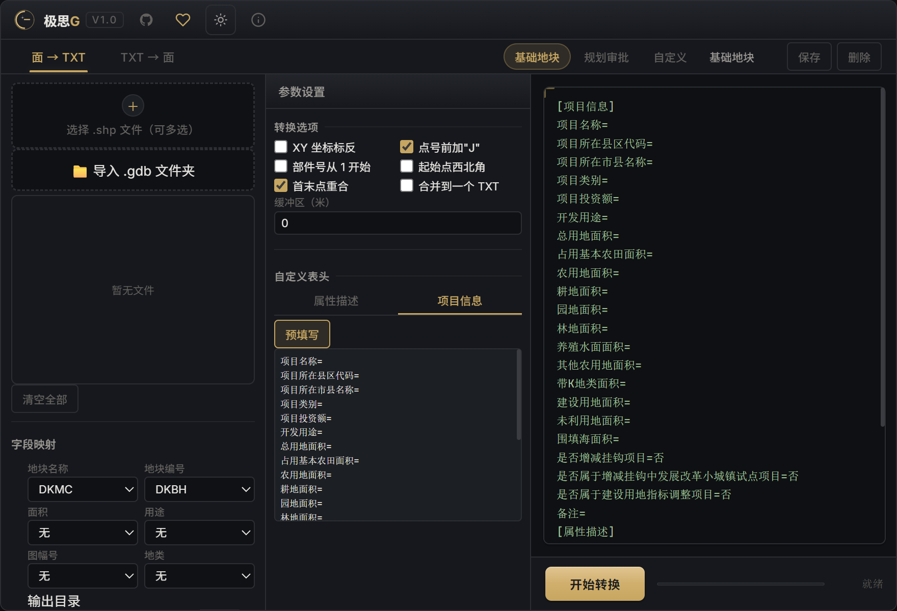

# polygon-txt

> 极思G界址点互转工具 — 面要素（SHP / GDB）与标准界址点 TXT 文件的双向转换

[English](./README.en.md) | 中文



## 简介

**极思G界址点互转工具** 是一款面向测绘与国土行业的轻量级 GIS 桌面工具，实现面要素（SHP / GDB）与标准界址点 TXT 文件的双向转换。纯 Rust 实现，**无需安装 ArcPy / ArcGIS**。

## 主要功能

- **面 → TXT**：导入 SHP、GDB 面要素，输出标准界址点 TXT 文件
- **TXT → 面**：解析 TXT 文件，生成 SHP 矢量面数据
- 三种输出模式：一对一 / 按地块拆分 / 全合并
- 支持 **2000 国家大地坐标系、1980 西安、1954 北京、WGS84**
- 高斯克吕格投影 3°/6° 分带，带号自动提取
- 字段自动匹配，智能识别坐标系
- 自动面积计算
- 浅色 / 暗色主题，自定义无边框窗口

## 下载安装

前往 [Releases](https://github.com/edcfoshan/polygon-txt/releases) 下载最新版本的 Windows 安装包，双击运行即可。

## 从源码构建

前置要求：[Node.js](https://nodejs.org/)、[Rust](https://www.rust-lang.org/)

```bash
npm install         # 安装前端依赖
npm run tauri dev   # 开发模式（热重载）
npm run tauri build # 生产构建（输出 NSIS 安装包）
```

## 技术栈

- **Tauri v2**（Rust 后端 + WebView 前端）
- **Rust**：shapefile / geonative-filegdb / chrono
- **前端**：原生 JS + Vite（单文件打包）

## 已知限制

- GDB 写入为最小化 OpenFileGDB 实现，ArcGIS Pro 兼容性有限（可回退 `ogr2ogr`）
- 部分政府格式 SHP 使用非标准格式（magic ≠ 9994），可能无法读取

## 许可证

[MIT License](./LICENSE)

## 交流与支持

扫码加入讨论群交流反馈：


如果这个工具对你有帮助，欢迎赞赏支持：


---

由 **极思 G** 提供技术支持
