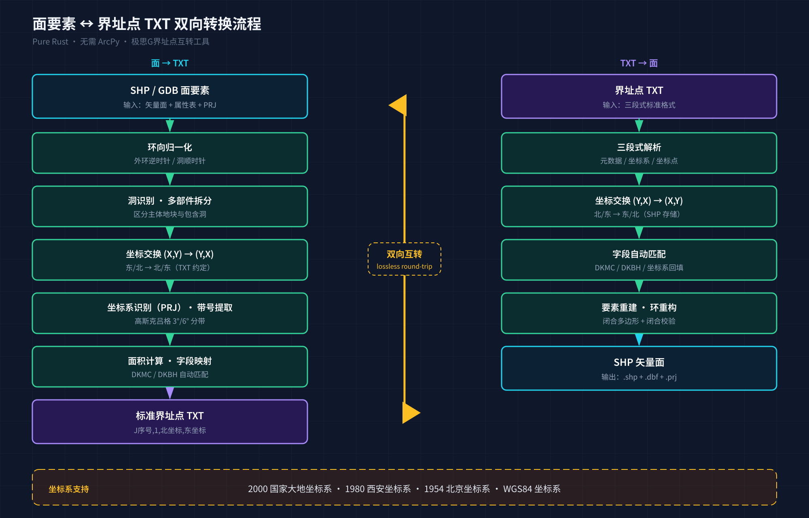

# 测绘人的界址点 TXT，为什么总在 Excel 里手工拼？

做过不动产登记、国土调查的朋友，多半经历过这样的场景——

甲方催着交宗地图，你打开 SHP，看着几千个面要素发呆。ArcGIS 里点来点去导不出标准格式，最后只能复制坐标到 Excel，一列列拼 `J1,1,Y,X`，拼到眼花。一个手抖，带号错了、坐标系错了，第二天返工。

**有没有一种可能——双击一下，SHP 和界址点 TXT 互转？**

## 这工具是干嘛的

**极思G界址点互转工具** 是一款专为测绘与国土行业打造的轻量级 GIS 桌面工具，核心就一件事：**面要素（SHP / GDB）与标准界址点 TXT 文件的双向转换**。纯 Rust 实现，无需安装 ArcPy / ArcGIS，下载即用。

## 核心功能

- **面 → TXT**：导入 SHP、GDB 面要素，一键输出标准界址点 TXT
- **TXT → 面**：解析 TXT 文件，生成 SHP 矢量面数据，属性表自动回填
- **三种输出模式**：
  - **一对一** — 每个导入源（SHP 文件 / GDB 要素类）输出一个 TXT，同名冲突自动追加 `_2/_3`
  - **按地块拆分** — 每个地块一个 TXT，文件名可用 DKMC/DKBH/序号/FID，字段缺失自动兜底
  - **全合并** — 所有地块合并为一个带时间戳的 TXT，适合整库归档
- **坐标系全覆盖**：2000 国家大地坐标系、1980 西安、1954 北京、WGS84
- **高斯克吕格投影** 3°/6° 分带，带号自动提取
- **字段自动匹配**、智能识别坐标系、**自动面积计算**
- 浅色 / 暗色主题，自定义无边框窗口

## 转换原理

很多人关心：坐标会不会偏？洞和飞地怎么处理？下面这张图说清楚了——

两个方向都不是简单的"复制粘贴"：**面 → TXT** 会先做环向归一化（外环逆时针、洞顺时针）、识别洞与多部件、交换坐标顺序、从 PRJ 识别坐标系并提取带号；**TXT → 面** 则反向重建闭合多边形并做闭合校验。整个过程保证**无损往返**（round-trip），转过去再转回来，坐标一根不差。

## 谁需要它

- **不动产登记**：宗地界址点表批量生成，几千个地块几分钟搞定，告别 Excel 手工拼点
- **国土调查 / 三调**：GDB 面要素批量导出为标准 TXT，或反向把外业 TXT 回填为 SHP，无缝对接政务上报系统
- **规划审批**：按地块拆分输出，一个地块一个 TXT，文件名即地块编号，交付清单清清爽爽
- **数据质检**：TXT ↔ 面要素互转做闭合校验，快速发现坐标串漏点、坐标顺序颠倒等老问题

## 下载与使用

Windows 用户前往 Releases 页下载安装包，双击运行，无需任何依赖：

👉 [立即下载（GitHub Releases）](https://github.com/edcfoshan/polygon-txt/releases)

三步上手：**选择源文件 → 选输出目录 → 点转换**。其余的，工具自己搞定。

开源地址：[github.com/edcfoshan/polygon-txt](https://github.com/edcfoshan/polygon-txt)

## 技术栈

基于 **Tauri v2**（Rust 后端 + WebView 前端）构建，体积小、启动快、零运行时依赖。GIS 读写使用 `shapefile` 与 `geonative-filegdb`，不依赖任何商业 GIS 软件。

## 为什么做这个工具

行业里不缺大而全的 GIS 平台，但**专做"界址点 TXT 互转"这件小事**、还能离线、免费、开源的工具，几乎没有。我们把它做出来并开源，就是希望同行少一点重复劳动，把时间花在更有价值的判读和分析上。代码托管在 GitHub，欢迎提 issue、PR，或反馈你的业务格式需求。

## 交流与支持

扫码加入讨论群，反馈需求、提交 bug、获取更新通知：

如果这个工具帮你省下了几个小时甚至几天，欢迎赞赏支持，让我们继续把它做得更好：

---

*由 **极思 G** 提供技术支持 · MIT 开源协议*
