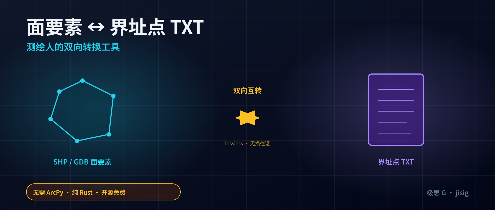
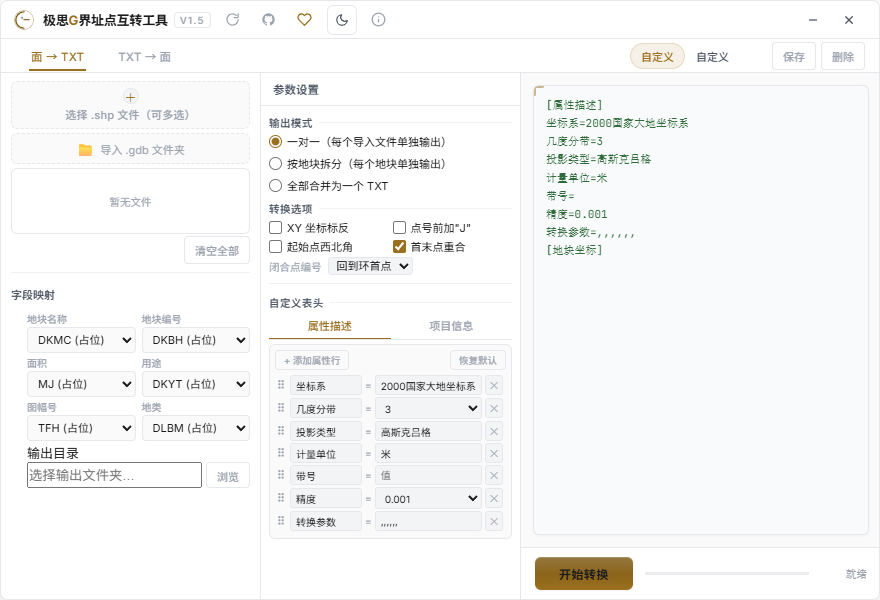
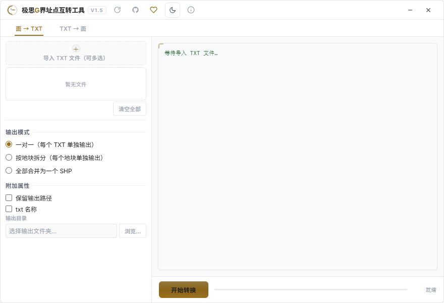
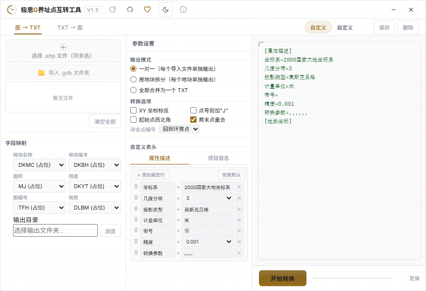

# 极思G界址点互转工具 V1.5 发布

## 📥 下载地址

**v1.5 安装包**（推荐，覆盖安装保留所有配置与预设）：
https://github.com/edcfoshan/polygon-txt/releases/download/v1.5/polygon-txt_1.5_x64-setup.exe

开源仓库：https://github.com/edcfoshan/polygon-txt
百度云（备选）：https://pan.baidu.com/s/1xyW3-hyZrFDDG9ijYOf46g 提取码: e8vy

> 已安装旧版本的用户，可在应用内点击标题栏右上角的刷新按钮一键自动更新到 V1.5，无需手动下载。

---

## 软件介绍

**极思G界址点互转工具** 是一款轻量级 GIS 实用工具，专为测绘与国土行业设计，支持常见面数据（**SHP / GDB**）与标准界址点 TXT 文件之间的**双向转换**。

传统作业流程里，界址点 TXT 与 GIS 面要素之间的互转往往要靠 ArcMap 配合 Python 脚本或人工处理，繁琐且易错。这款工具把这件**最常做的小事**做成了**一键操作**——选文件、点转换、出结果，中间不用写一行代码。

无边框 880×600 紧凑窗口，启动秒开，常驻任务栏不打扰；浅色/暗色主题随系统切换，长时间用也不刺眼。

### 重点功能

- **面 → TXT**：导入 SHP（含 DBF/PRJ）、GDB 要素类，输出符合国土行业标准的界址点 TXT 文件
- **TXT → 面**：解析标准 TXT，生成带 DBF 属性表的 SHP 矢量面数据，可直接进 ArcMap / QGIS / ArcGIS Pro
- **三种输出模式**：一对一 / 按地块拆分 / 全合并，按需选用
- **多坐标系支持**：2000 国家大地坐标系、1980 西安、1954 北京、WGS84，**自动识别 PRJ**
- **高斯克吕格投影**：3°/6° 分带，**带号自动提取**
- **统一字段映射面板**：地块名/编号/面积/用途等字段**自动匹配**，无需手填
- **自动面积计算**：按米为单位的椭球面积，输出到 TXT 属性段
- **坐标顺序灵活切换**：标准 (Y,X) 与 (X,Y) 一键互换
- **配套 ArcMap 工具箱**：特殊地块优选 / 坐标转换的 tbx 工具箱，下载包内附带
- **应用内自动更新**（v1.3+）：有新版本标题栏一键更新，无需再去网盘手动找

---

## 从 v1.0 到 v1.5 — 五次迭代记录

工具自首次公开发布以来，根据一线作业反馈持续打磨，几乎每次更新都来自用户的真实痛点。

### v1.5.0 — 2026.06.30（本次更新）

**新增**

- 界址点 J 编号改为**单个地块内跨环（外环 / 洞 / 多部件）连续递增**，每个地块仍从 J1 起。改动前，挖空洞或多部件地块的 J 序号会反复从 J1 重置、靠界址线号区分；改后序号在本地块内连续，更符合"一宗一表"的行业惯例
- 「首末点重合」新增**「闭合点编号」下拉**：可选「回到环首点」（默认，闭合点回本环首序号） 或「续编」（闭合点占下一个连续序号），方便对接不同单位的接收格式
- 新下拉未勾首末点重合时**置灰**，避免误导；选项随预设保存/恢复

### v1.4.0 — 2026.06.29

**新增**

- 「属性描述」段高度自定义：原 7 个固定项（坐标系/几度分带/投影类型/计量单位/带号/精度/转换参数）改为**可增删改键名**的属性行列表，可任意位置插入自定义行（如「格式版本号」「数据产生单位」「数据产生日期」）
- **属性行拖拽排序**：按住行首 ⠿ 手柄上下拖动即可调整顺序
- 「精度」「几度分带」字段恢复下拉选择（固定候选值）

### v1.3.0 — 2026.06.26

**新增**

- **应用内自动更新**：启动时自动检查新版本，标题栏常驻三态按钮（默认刷新 / 有新版本绿箭头 / 已跳过灰箭头），点击即可在应用内下载安装并自动重启
- 更新提醒支持「**跳过此版本**」、**24 小时节流**、下载失败兜底跳百度云
- 国内用户检查更新走 jsDelivr + ghproxy 镜像加速

**修复**

- 导入含中文 DBF 字段名（如"村民姓/行政村/备注"）的 SHP 文件时软件闪退（dbase crate 解析失败兜底）
- 导入 GBK 编码的 SHP（DBF 无 .cpg）/ TXT 时无反应或乱码（自动探测 BOM / UTF-8 / GBK）
- DBF 字段名/值编码探测：优先读 .cpg，无 .cpg 时采样字节判定 GBK

### v1.2.0（补丁更新）

**修复**

- 个别政府格式 SHP（magic ≠ 9994）的解析告警文案优化
- TXT→SHP 大批量地块时的进度反馈

### v1.0.0 — 2026.06.24（首次公开发布）

- 面 → TXT 双向转换（导入 SHP / GDB 面要素，输出标准界址点 TXT）
- TXT → 面转换（解析 TXT，生成 SHP 矢量面数据）
- 三种输出模式：一对一 / 按地块拆分 / 全合并
- 2000 国家大地坐标系 / 1980 西安 / 1954 北京 / WGS84 自动识别
- 高斯克吕格 3°/6° 分带，带号自动提取
- 统一字段映射面板，字段自动匹配
- 自动面积计算
- 浅色 / 暗色主题切换

---

## 应用截图

两种主模式：

| 面 → TXT（导入 SHP/GDB，输出界址点 TXT） | TXT → 面（解析 TXT，生成 SHP） |
|---|---|
|  |  |

### v1.5 新功能演示：闭合点编号模式

「首末点重合」勾上时，下方可选择闭合点的 J 序号规则：默认**回到环首点**（回写本环首序号），切换到**续编**则闭合点占下一个连续序号。未勾首末点重合时下拉自动置灰。

转换流程示意：

---

## 加入交流群 + 支持作者

使用中遇到问题、想提需求、想看开发计划，欢迎扫码加 QQ 群一起聊：

*扫码加群交流反馈*

觉得好用的话，可以请作者喝一杯 ☕：

---

工具完全开源，欢迎到 GitHub 提 Issue / PR：
https://github.com/edcfoshan/polygon-txt