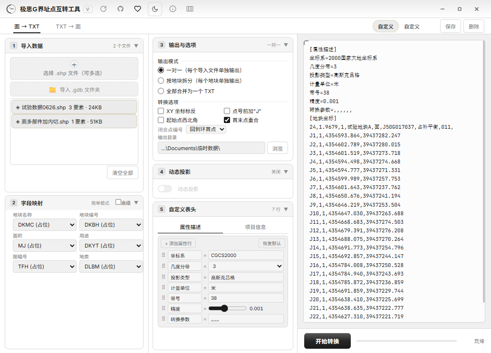
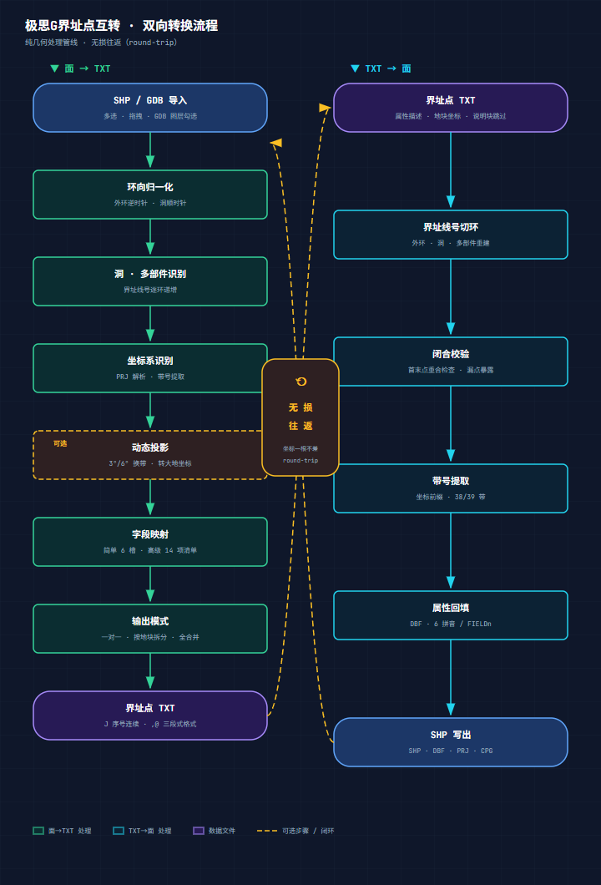
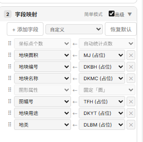
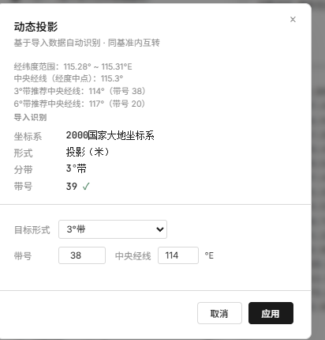
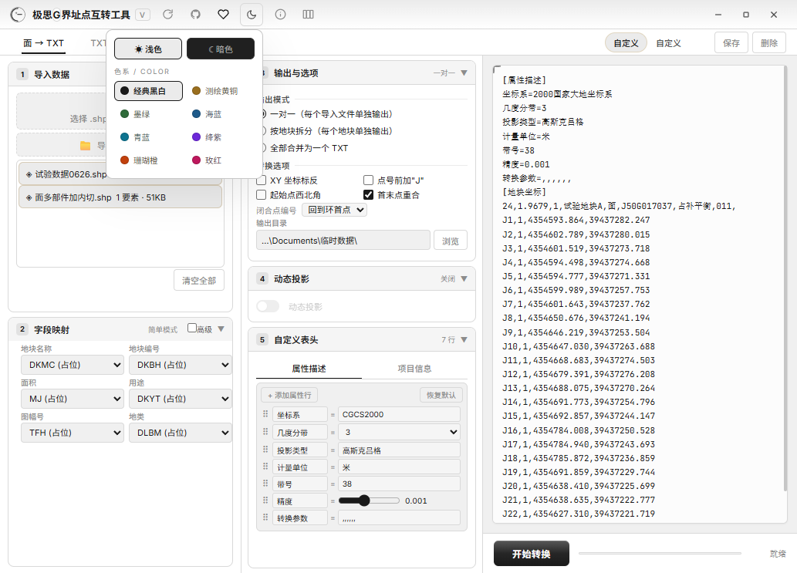
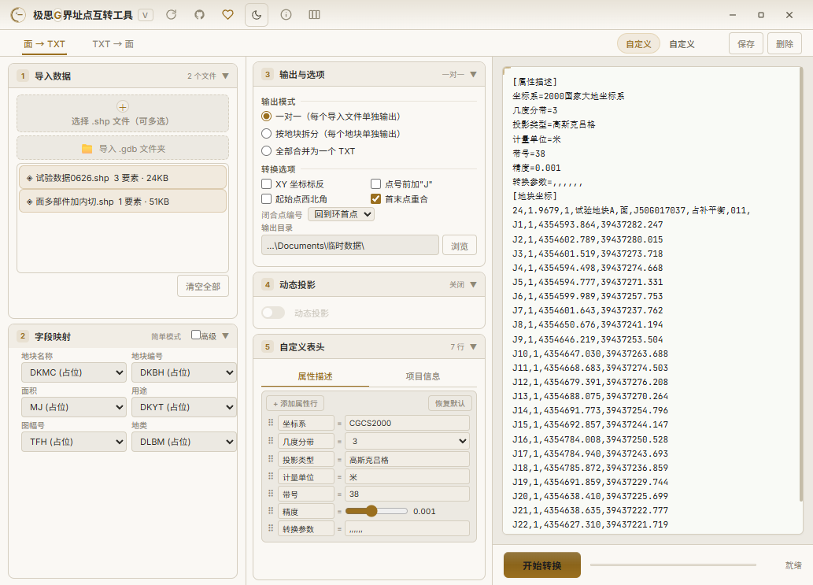
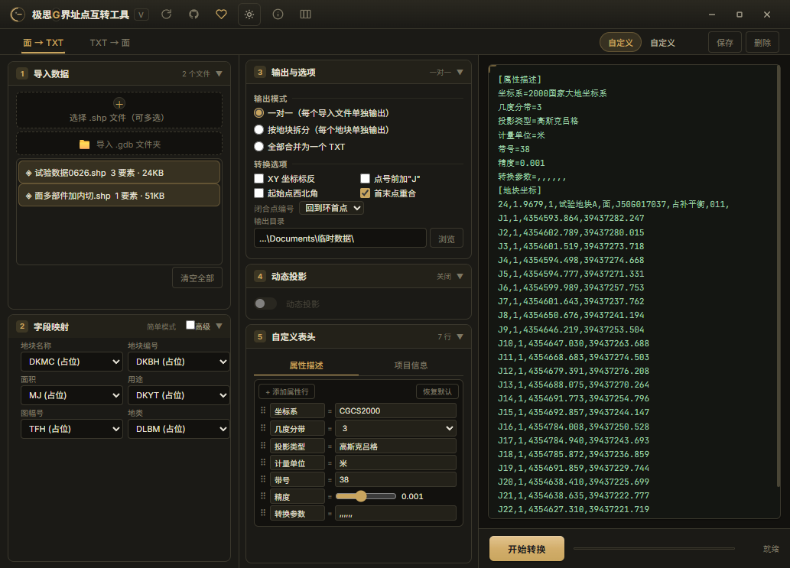
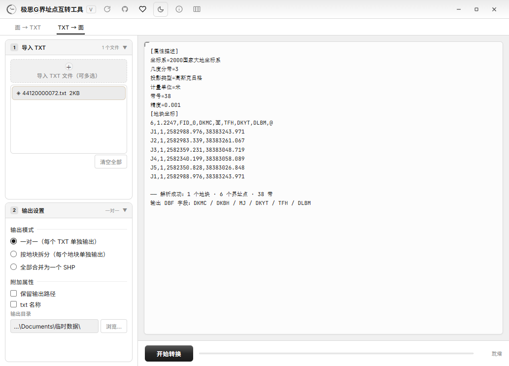
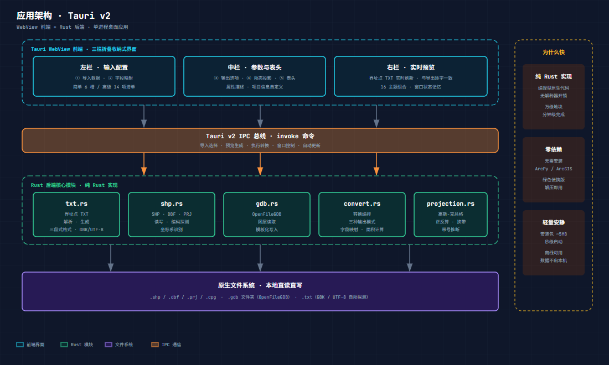

# 极思G界址点互转工具 V3.0 发布

## 📥 下载地址

**v3.0 安装包**（推荐，覆盖安装保留所有配置与预设）：
https://github.com/edcfoshan/polygon-txt/releases/download/v3.0.0/polygon-txt_3.0_x64-setup.exe

开源仓库：https://github.com/edcfoshan/polygon-txt

百度云（备选）：https://pan.baidu.com/s/1xyW3-hyZrFDDG9ijYOf46g 提取码: e8vy

> 已安装旧版本的用户，在应用内点击标题栏右上角的刷新按钮即可一键自动更新到 V3.0，无需手动下载。

---

## 软件介绍

**极思G界址点互转工具** 是一款轻量级 GIS 实用工具，专为测绘与国土行业设计，支持常见面数据（**SHP / GDB**）与标准界址点 TXT 文件之间的**双向转换**。

传统作业流程里，界址点 TXT 与 GIS 面要素之间的互转往往要靠 ArcMap 配合 Python 脚本或人工处理，繁琐且易错。这款工具把这件**最常做的小事**做成了**一键操作**——选文件、点转换、出结果，中间不用写一行代码。

---

## 核心功能详解

### 1. 双向转换 · 无损往返

转换不是简单的"复制粘贴"。**面 → TXT** 方向会先做环向归一化（外环逆时针、洞顺时针），识别洞与多部件并逐环编号界址线号，从 PRJ 自动识别坐标系并提取带号；**TXT → 面** 方向则按界址线号切环重建多边形、校验首末点闭合、回填 DBF 属性表。整个过程保证**无损往返**——转过去再转回来，坐标一根不差。

- **面 → TXT**：SHP / GDB 面要素一键输出标准界址点 TXT，J 序号在单个地块内跨环连续递增
- **TXT → 面**：解析 TXT 生成带属性表的 SHP，可直接进 ArcMap / QGIS / ArcGIS Pro
- **三种输出模式**：一对一（每源一个 TXT）/ 按地块拆分（文件名取自 DKMC 等字段）/ 全合并（整库归档带时间戳）

### 2. 字段映射 · 从简单到专业

三档字段映射满足不同精度需求：

- **简单模式**：地块名称、编号、面积、用途、图幅号、地类六个槽位，源字段下拉直选
- **高级模式**：14 项固定字段清单自由增删、拖拽排序
- **补充耕地预设**：一键载入 12 字段模板（图斑面积、图斑编号、补充耕地实施年份、耕地坡度级别、备注、耕地质量等级……），直接对接补充耕地数据上报格式

字段名支持中英文占位（DKMC/DKBH 行业惯例），面积可自动按平方米或公顷计算，未选字段输出空值列保持列序稳定。

### 3. 动态投影 · 坐标系全覆盖

支持 2000 国家大地坐标系、1980 西安、1954 北京、WGS84 四大坐标系，PRJ 自动识别。**动态投影**功能可在导出时一键完成 3°/6° 分带互换、换带（如 38 带 → 39 带）、转大地坐标——弹窗内自动推荐目标形式与中央经线，导入数据后按经纬度范围智能推算，不用查表。

### 4. 界面记忆 · 接着上次继续

所有设置（预设方案、字段映射、表头、主题、色系、显示比例）连同**窗口大小和位置**一起持久化——关掉再开，一切保持上次的样子，不用重复配置。

---

## 三个典型场景

**场景一：不动产登记 · 批量出界址点表**

宗地数据库里成百上千个面要素，要在期限内交齐界址点材料。导入 SHP，选「按地块拆分」模式，文件名用地块编号——点一次转换，每个宗地一个 TXT，文件名即编号，交付清单清清爽爽。面积按公顷自动算好写进属性段，不用再开 Excel 逐个算。

**场景二：补充耕地 · 数据上报对接**

补充耕地项目要求按 12 字段格式上报：图斑面积、图斑编号、补充耕地实施年份、耕地坡度级别、地类、耕地质量等级……手工拼格式极易错列。高级字段模式选「补充耕地模式」预设，12 个字段一次到位，字段映射到源 GDB 属性列即可批量导出，直接对接接收系统的约定列序。

**场景三：外业 TXT · 回流质检**

外业回来的一批界址点 TXT，需要回建为面数据并做质检。TXT → 面方向会按界址线号切环、校验首末点闭合——**坐标串漏点、坐标顺序颠倒、带号填错**这些老问题，在反向转换时会直接暴露出来；转换结果与原始数据做无损往返比对，心里更有底。

---

## V3.0 界面焕新

V3.0 是迄今最大的一次界面重构，按**「折叠收纳式」**方案重新设计，功能不变、操作习惯不变。

### 🗂 编号分组，一屏看全

三栏布局：左栏 **①导入数据 + ②字段映射**，中栏 **③输出与选项（含输出目录）+ ④动态投影 + ⑤自定义表头**，右栏实时预览。每个分组都是带编号的折叠卡，点击标题展开/收起——配置再多也不拥挤，常用项默认全开。

TXT→面 方向同样是 **①导入 TXT + ②输出设置** 编号分组，两个方向体验一致。

### 🎨 16 种主题组合

标题栏主题按钮升级为下拉面板：**浅色 / 暗色** × **8 个色系**（经典黑白（新默认）/ 测绘黄铜 / 墨绿 / 海蓝 / 青蓝 / 绛紫 / 珊瑚橙 / 玫红）。色系是全套配色联动——背景、面板、边框、预览区一起换。喜欢行业味用测绘黄铜，外业光线强切暗色，选择自动记住。

### 其他改进

- 「补充耕地模式」升级为预设下拉（8 字段标准 / 补充耕地模式 / 自定义），手改自动变「自定义」
- 预览区浅色模式黑色字体，长坐标行阅读更省眼；修复黑白主题下按钮文字对比度
- 窗口默认 1100×800，三栏 1:1:1.3，预览更宽敞；自定义表头完整显示

---

## 技术架构

工具基于 **Tauri v2**（Rust 后端 + WebView 前端）构建：界面层只负责交互与实时预览，转换逻辑全部在 Rust 原生模块中完成（txt 解析生成 / SHP·DBF·PRJ 读写 / OpenFileGDB / 转换编排 / 高斯-克吕格投影），通过 IPC 总线通信，本地文件直读直写。

纯 Rust 编译型原生代码，无解释器开销——万级地块分钟级完成；无需安装 ArcPy / ArcGIS，绿色便携版解压即用；安装包约 5MB，秒级启动，全程离线，数据不出本机。

> V2.0 以来还上线了动态投影重构、ArcGIS Pro GDB 兼容修复、补充耕地 12 字段高级模式等功能，详见仓库 CHANGELOG。

## 交流与支持

扫码加入讨论群，反馈需求、提交 bug、获取更新通知：

如果这个工具帮你省下了几个小时甚至几天，欢迎赞赏支持，让我们继续把它做得更好：

---

*由 **极思 G** 提供技术支持 · MIT 开源协议*
